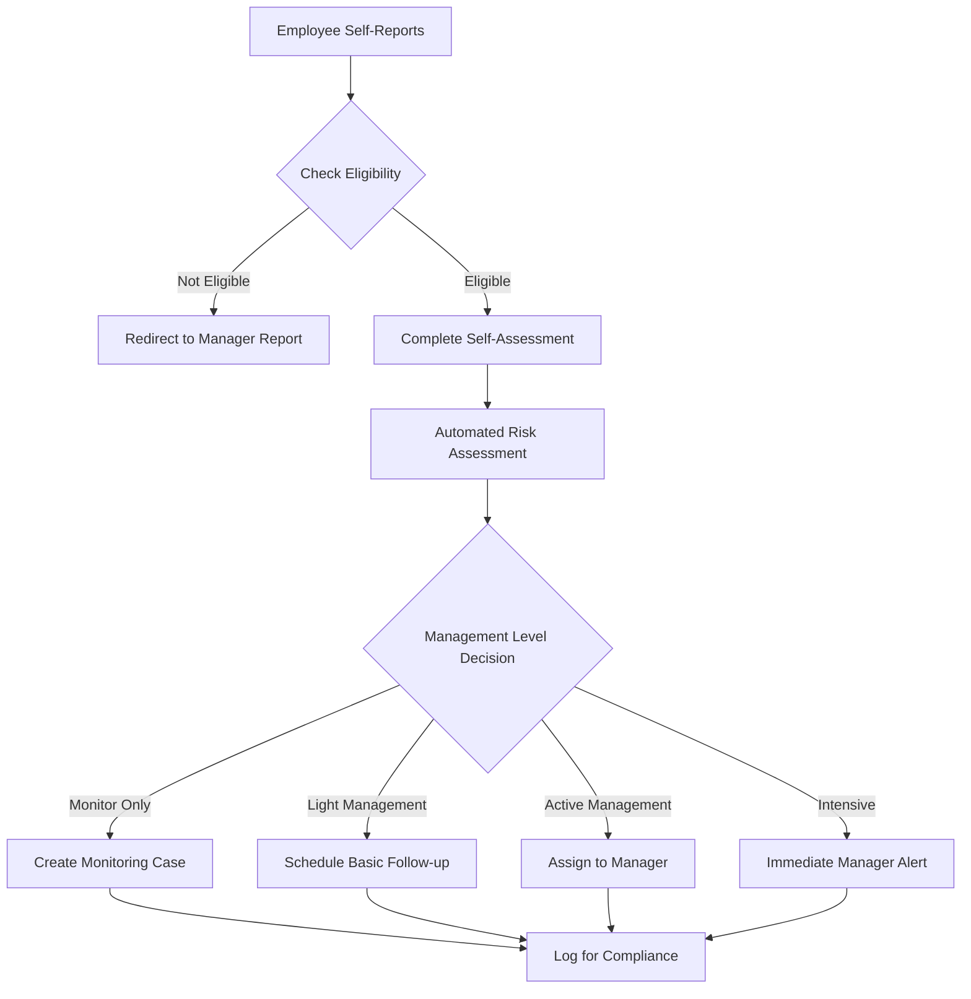

# Self-Reporting Feature with Selective Eligibility

## 1. Self-Reporting System Architecture

### Employee Eligibility Management

#### Database Schema Extensions
```sql
self_reporting_eligibility
├── id (PK)
├── employee_id (FK -> users)
├── is_eligible (boolean)
├── eligibility_reason (Trusted Employee, Low Risk History, etc.)
├── max_self_report_days (3, 5, 7, etc.)
├── allowed_absence_types (JSON array)
├── requires_manager_approval (boolean)
├── auto_approval_threshold (days)
├── eligibility_start_date
├── eligibility_end_date
├── review_frequency_days (90, 180, 365)
└── last_review_date

self_reporting_logs
├── id (PK)
├── employee_id (FK -> users)
├── report_date
├── absence_type
├── duration_days
├── auto_approved (boolean)
├── manager_review_required (boolean)
├── manager_reviewed_by (FK -> users)
├── review_date
├── review_notes
└── compliance_score
```

### Self-Reporting Workflow Design

#### Eligibility Assessment Logic
```typescript
interface SelfReportingEligibility {
  checkEligibility(employeeId: string): EligibilityResult;
  calculateRiskScore(employee: User): number;
  determineMaxDays(employee: User, absenceType: string): number;
  requiresManagerApproval(employee: User, duration: number): boolean;
}

interface EligibilityResult {
  isEligible: boolean;
  maxDays: number;
  allowedTypes: string[];
  requiresApproval: boolean;
  riskLevel: 'Low' | 'Medium' | 'High';
  nextReviewDate: Date;
}
```

## 2. Self-Reporting Questionnaire System

### Smart Question Flow for Self-Assessment

#### Initial Screening Questions
```
SELF-REPORTING ABSENCE ASSESSMENT
─────────────────────────────────

BASIC INFORMATION
• Absence Type: [Sick Leave, Medical Appointment, Family Emergency]
• Start Date: [Today, Yesterday, Custom]
• Expected Duration: [1 day, 2-3 days, 4+ days]

SYMPTOM ASSESSMENT (Conditional)
• Primary Symptoms: [Fever, Respiratory, Gastrointestinal, etc.]
• Contagious: [Yes, No, Unsure]
• Severity: [Mild, Moderate, Severe]

IMPACT ASSESSMENT
• Able to perform light duties if needed? [Yes, No]
• Require medical attention? [Yes, No, Already Seen]
• Have necessary medications/treatment? [Yes, No]

RISK EVALUATION
• Previous similar absences this year: [0, 1-2, 3+]
• Current work pressures/stress level: [Low, Medium, High]
• Support system available: [Good, Limited, None]
```

### Automated Management Level Determination

#### Decision Matrix Logic
```typescript
interface ManagementLevelDecision {
  determineManagementLevel(answers: SelfReportAnswers): ManagementLevel;
  calculateRiskScore(answers: SelfReportAnswers): number;
  triggerManagerReview(riskScore: number, duration: number): boolean;
}

enum ManagementLevel {
  MONITOR_ONLY = 'monitor_only',      // No active management needed
  LIGHT_MANAGEMENT = 'light_management', // Basic follow-up only
  ACTIVE_MANAGEMENT = 'active_management', // Standard manager involvement
  INTENSIVE_MANAGEMENT = 'intensive_management' // High-touch management
}

// Example decision logic
function determineManagementLevel(answers: SelfReportAnswers): ManagementLevel {
  const riskScore = calculateRiskScore(answers);
  const duration = answers.expectedDuration;
  
  if (riskScore < 20 && duration <= 2) return ManagementLevel.MONITOR_ONLY;
  if (riskScore < 40 && duration <= 3) return ManagementLevel.LIGHT_MANAGEMENT;
  if (riskScore < 60 || duration > 5) return ManagementLevel.ACTIVE_MANAGEMENT;
  return ManagementLevel.INTENSIVE_MANAGEMENT;
}
```

## 3. Configuration & Administration

### Admin Interface for Eligibility Management

#### Eligibility Configuration Screen
```
SELF-REPORTING ELIGIBILITY MANAGEMENT
─────────────────────────────────────

ELIGIBILITY CRITERIA
○ Enable for all employees
○ Enable based on criteria
○ Enable for selected employees only

AUTOMATIC ELIGIBILITY RULES
[ ] Minimum employment duration: [6 months ▼]
[ ] Maximum absences last year: [3 ▼] 
[ ] No disciplinary issues in: [12 months ▼]
[ ] Completion of self-reporting training: [Required ▼]

MANUAL OVERRIDES
[Search employee...] [Add to Eligible List]

ELIGIBLE EMPLOYEES (24)
┌─────────────────┬──────────┬────────────┬────────────┐
│ Employee        │ Max Days │ Auto-Apprv │ Last Review│
├─────────────────┼──────────┼────────────┼────────────┤
│ John Smith      │ 3 days   │ Yes        │ 45 days ago│
│ Jane Doe        │ 5 days   │ No         │ 30 days ago│
│ Mike Johnson    │ 2 days   │ Yes        │ 60 days ago│
└─────────────────┴──────────┴────────────┴────────────┘
```

### Self-Reporting Settings by Employee
```sql
employee_self_reporting_settings
├── id (PK)
├── employee_id (FK -> users)
├── can_self_report (boolean)
├── max_self_report_days
├── auto_approval_enabled (boolean)
├── requires_retroactive_approval (boolean)
├── allowed_absence_types (JSON)
├── special_notes
├── settings_effective_date
└── settings_expiry_date
```

## 4. Workflow Integration

### Self-Reporting vs Manager-Reported Workflows

#### Self-Reporting Flow


### Manager Oversight & Approval Workflow

#### Manager Dashboard for Self-Reports
```
SELF-REPORTING OVERVIEW
───────────────────────
PENDING REVIEW (3)
• John Smith - 2 days (Monitor Only) - [Approve] [Review]
• Jane Doe - 1 day (Auto-Approved) - [View Details]
• Mike Brown - 3 days (Requires Approval) - [Approve] [Request Info]

RECENT SELF-REPORTS (Last 7 Days)
┌─────────────────┬──────┬────────────┬────────────┐
│ Employee        │ Days │ Status     │ Risk Score │
├─────────────────┼──────┼────────────┼────────────┤
│ Sarah Wilson    │ 1    │ Approved   │ Low (15)   │
│ Tom Davis       │ 2    │ Monitoring │ Low (22)   │
│ Lisa Chen       │ 3    │ Managed    │ Med (45)   │
└─────────────────┴──────┴────────────┴────────────┘

COMPLIANCE METRICS
• Self-Report Accuracy: 94%
• Auto-Approval Rate: 68%
• Manager Review Time: 2.3 hours
```

## 5. Compliance & Fraud Prevention

### Self-Reporting Integrity Measures

#### Validation and Audit Systems
```sql
self_reporting_audit
├── id (PK)
├── employee_id (FK -> users)
├── report_date
├── absence_details (JSON)
├── risk_assessment_score
├── management_level_assigned
├── actual_duration (nullable)
├── discrepancy_detected (boolean)
├── audit_notes
├── reviewed_by_manager (FK -> users)
└── audit_date
```

#### Pattern Detection for Abuse Prevention
```typescript
interface SelfReportingMonitor {
  detectSuspiciousPatterns(employeeId: string): PatternAlert[];
  calculateComplianceScore(employeeId: string): number;
  triggerEligibilityReview(employeeId: string, reason: string): void;
}

interface PatternAlert {
  type: 'FREQUENT_REPORTS' | 'PATTERN_MATCHING' | 'WEEKEND_TREND';
  severity: 'LOW' | 'MEDIUM' | 'HIGH';
  confidence: number;
  recommendedAction: 'MONITOR' | 'REVIEW' | 'SUSPEND';
}
```

### Graduated Response System

#### Response Levels for Pattern Detection
```
SELF-REPORTING COMPLIANCE RESPONSE
──────────────────────────────────
LEVEL 1: Monitoring (Minor patterns)
• Increased audit sampling
• Manager notification
• No restriction changes

LEVEL 2: Enhanced Review (Moderate patterns)  
• All self-reports require manager approval
• Reduced maximum self-report days
• Mandatory follow-up documentation

LEVEL 3: Restricted Access (Significant patterns)
• Self-reporting suspended
• All absences require manager reporting
• Formal review with HR
• Possible training requirement

LEVEL 4: Investigation (Severe patterns)
• Complete self-reporting suspension
• Historical review of all absences
• Disciplinary process initiation
```

## 6. Benefits & Implementation Strategy

### Key Benefits
1. **Reduced Administrative Burden**: Fewer manager-reported sick calls
2. **Faster Processing**: Immediate logging without doctor's note delays
3. **Employee Empowerment**: Trust-based system for responsible employees
4. **Data Quality**: Structured self-assessment provides better insights
5. **Scalable**: Handles high-volume minor absences efficiently

### Implementation Phases

#### Phase 1: Pilot Program (Weeks 1-4)
- [ ] Basic self-reporting for trusted employees
- [ ] Simple eligibility criteria
- [ ] Manual manager approval for all self-reports
- [ ] Basic reporting and monitoring

#### Phase 2: Expanded Access (Weeks 5-8)
- [ ] Automated eligibility assessment
- [ ] Risk-based management level determination
- [ ] Auto-approval for low-risk cases
- [ ] Enhanced reporting and analytics

#### Phase 3: Optimization (Weeks 9-12)
- [ ] Pattern detection and fraud prevention
- [ ] Machine learning risk assessment
- [ ] Mobile self-reporting app
- [ ] Integration with payroll systems

#### Phase 4: Full Deployment (Weeks 13+)
- [ ] Organization-wide rollout
- [ ] Continuous improvement based on data
- [ ] Advanced features and customization
- [ ] Compliance and audit enhancements

## 7. Integration with Existing Features

### Connection to Mental Health Support
- Self-reporting includes mental health screening questions
- Automated escalation for mental health risk indicators
- Integration with mental health resource database
- Special protocols for mental health self-reports

### Data-Driven Optimization Integration
- Self-reporting data feeds into analytics system
- Comparison of self-reported vs manager-reported outcomes
- Impact analysis on return-to-work duration
- Continuous improvement of self-assessment questions