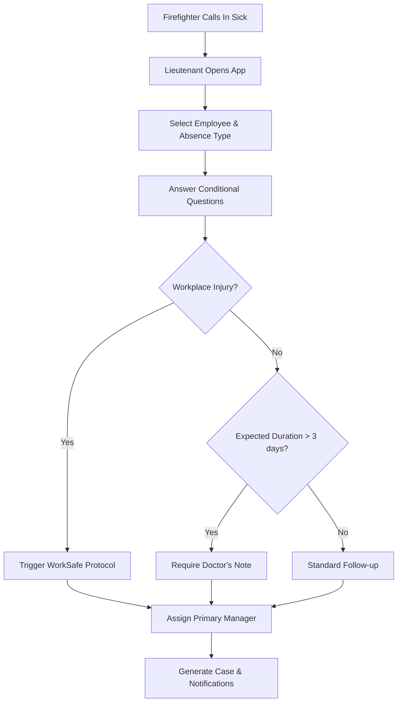
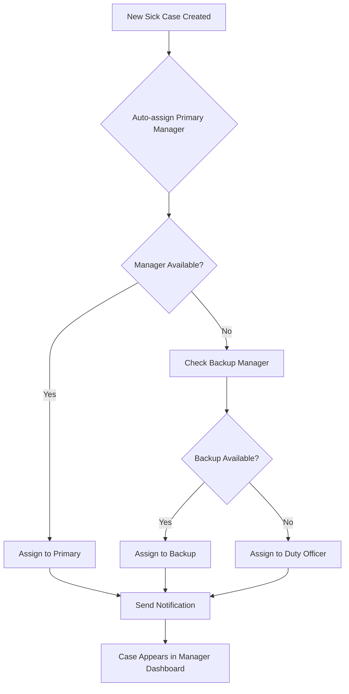

# Sick Leave Management System - UI Wireframes & User Flows

## 1. Core User Interface Components

### Dashboard Layout
```
┌─────────────────────────────────────────────────────────────┐
│ 🏥 SICK LEAVE MANAGEMENT SYSTEM                            │
├─────────────────┬─────────────────┬─────────────────┬───────┤
│ Active Cases    │ Pending Tasks   │ Today's Shifts  │ Alerts│
│ 12              │ 8               │ A Platoon       │ 3     │
├─────────────────┴─────────────────┴─────────────────┴───────┤
│ QUICK ACTIONS                                                │
│ [Report Sick Call] [View Duty Roster] [Manage Cases]        │
├─────────────────────────────────────────────────────────────┤
│ RECENT ACTIVITY                    │ UPCOMING TASKS         │
│ • FF Smith - Sick (2 days)         │ • Follow-up: Jones     │
│ • LT Brown assigned to Davis       │ • Document due: Wilson │
│ • WorkSafe form submitted          │ • Check-in: Taylor     │
└─────────────────────────────────────────────────────────────┘
```

### Sick Call Intake Form (Step-by-Step)

#### Step 1: Basic Information
```
REPORT SICK CALL
────────────────────────────────
Employee: [John Smith ▼]
Call Received By: [Auto-filled: Current User]
Date/Time: [Auto-filled: Current Time]

Absence Type:
○ Sick Leave
○ Workplace Injury
○ Medical Appointment
○ Family Emergency
○ Other

[Next] [Cancel]
```

#### Step 2: Conditional Questions (Dynamic)
```
SYMPTOM ASSESSMENT
────────────────────────────────
Primary Symptoms: [Fever, Cough, Fatigue...]

Is this contagious? ○ Yes ○ No

Expected Duration: [1-2 days ▼]

Does this affect ability to perform duties?
○ Fully Incapacitated
○ Limited Duties Possible
○ Full Duties Possible

[Previous] [Next]
```

#### Step 3: Documentation Requirements
```
DOCUMENTATION NEEDED
────────────────────────────────
Based on your answers, the following are required:

✓ Doctor's Note (if absence exceeds 3 days)
✓ WorkSafeBC Form 6A (Workplace Injury)
○ Return-to-Work Assessment

Additional Notes: [Text area]

[Previous] [Submit Report]
```

## 2. User Flows

### Firefighter Reporting Sick


### Manager Case Assignment


## 3. Key Screens Design

### Case Management Dashboard
```
CASE MANAGEMENT - FF JOHNSON (Sick Leave - Day 2)
──────────────────────────────────────────────────
Status: ACTIVE │ Severity: MODERATE │ Manager: LT BROWN

TIMELINE
● Day 1: Reported sick - fever, cough
● Day 1: Assigned to Lt. Brown
● Day 2: Follow-up call completed
● Day 3: Doctor's note due

ACTIONS REQUIRED
[ ] Schedule follow-up call
[ ] Upload doctor's note (Due: Tomorrow)
[ ] Update return-to-work estimate

DOCUMENTATION
✓ Initial report
○ Doctor's note (Pending)
○ WorkSafe form (Not required)

NOTES & COMMENTS
[Add new note...]
• Lt. Brown: Spoke with FF Johnson, symptoms improving
• Capt. Davis: Monitor for return-to-work clearance
```

### Duty Roster View
```
DUTY ROSTER - STATION 1
──────────────────────────────────────────────────
TODAY'S ASSIGNMENTS (24-Hour Shift)

PRIMARY MANAGERS
• A Platoon: Capt. Wilson (On Duty)
• B Platoon: Lt. Brown (Off Duty)
• C Platoon: Lt. Davis (Off Duty)

BACKUP COVERAGE
• Duty Officer: Batt. Chief Miller
• Emergency Contact: Capt. Taylor

ACTIVE CASES BY MANAGER
• Capt. Wilson: 3 cases
• Lt. Brown: 2 cases  
• Lt. Davis: 1 case

UPCOMING SHIFT CHANGES
• Next: B Platoon in 6 hours
• Handoff required: 2 active cases
```

## 4. Mobile Interface Considerations

### Mobile Dashboard
```
┌────────────────────────┐
│ 🏥 SICK MGMT          │
├────────────────────────┤
│ 👤 John Smith         │
│ Lieutenant, Station 1  │
├────────────────────────┤
│ 📊 Active Cases: 3    │
│ ⏰ Pending Tasks: 5    │
│ 🔔 Alerts: 2          │
├────────────────────────┤
│ [Report Sick Call]     │
│ [View My Cases]       │
│ [Duty Roster]         │
│ [Quick Actions]       │
└────────────────────────┘
```

### Quick Sick Call Reporting (Mobile)
```
QUICK SICK CALL
────────────────
Employee: [Search...]

Type: ○ Sick ○ Injury ○ Other

Quick Assessment:
[ ] Contagious
[ ] Extended absence expected
[ ] Workplace related

[Submit & Notify Manager]
```

## 5. Notification System Design

### In-App Notifications
```
NOTIFICATIONS (3)
──────────────────
🔄 FOLLOW-UP REQUIRED
FF Taylor - Check-in overdue by 2 hours
[View Case] [Mark Complete]

📄 DOCUMENT DUE
Doctor's note for FF Wilson due today
[Upload] [Request Extension]

🔔 NEW ASSIGNMENT
You have been assigned to FF Davis case
[Accept] [View Details]
```

### Email/SMS Templates
```
SMS Alert: New Sick Case
────────────────────────
New sick case: FF Johnson
Type: Sick Leave
Expected: 2-3 days
Action: Please review and assign follow-up
Link: https://app.sickmgmt/case/123

Email: Documentation Reminder
─────────────────────────────
Subject: Document Due - FF Wilson

Dear Lt. Brown,

A doctor's note for FF Wilson is due today.
Please upload the document or request an extension.

Case Details:
- Start Date: Nov 9, 2024
- Expected Return: Nov 12, 2024
- Current Status: Active

[Upload Document] [View Case]
```

## 6. Form Integration Points

### WorkSafeBC Form Integration
```
WORKSAFEBC CLAIM - FF JOHNSON
──────────────────────────────
EMPLOYEE INFORMATION
Name: John Smith
Employee ID: FD-1234
Date of Injury: [Nov 9, 2024]

INJURY DETAILS
Nature of Injury: [Sprain/Strain ▼]
Body Part: [Back/Lumbar ▼]
How Occurred: [Lifting patient ▼]

WITNESS INFORMATION
Witness Name: [Lt. Brown]
Witness Statement: [Text area]

ATTACHMENTS
○ Incident Report
○ Medical Records
○ Witness Statements

[Generate Form 6A] [Save Draft]
```

### Doctor's Note Template
```
MEDICAL CERTIFICATE REQUEST
───────────────────────────
To: Dr. [Provider Name]
From: Fire Department Medical Office

Patient: John Smith
Employee ID: FD-1234

Please complete the following:
○ Diagnosis/condition
○ Expected duration of absence
○ Work restrictions upon return
○ Follow-up requirements

[Print Form] [Email to Provider]
```

## 7. Accessibility Considerations

- High contrast mode for station environments
- Large touch targets for mobile use
- Voice-to-text for quick reporting
- Offline capability for poor connectivity areas
- Keyboard navigation for desktop users